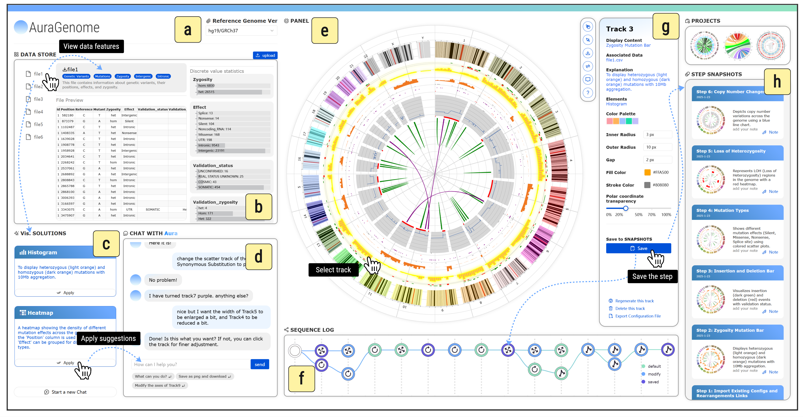
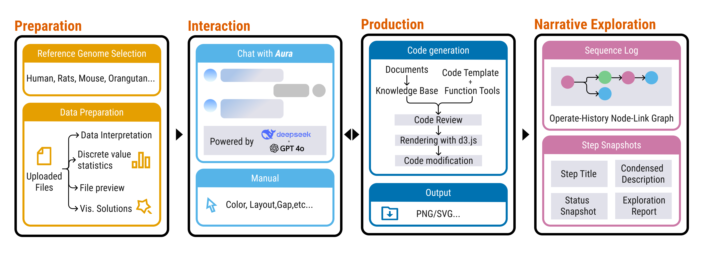

# AuraGenome

A full-stack project based on Vue3 and Python for automated generation and visualization of circular genomics diagrams.

[](https://vuejs.org/) [](https://www.python.org/) [](https://flask.palletsprojects.com/) [](https://vitejs.dev/)
[](https://opensource.org/licenses/MIT)  [](#)  [](#)


---



## Requirements

- Python 3.x
- Node.js 16+
- Conda (for Python environment management)

## Installation

### Backend Setup

1. Create and activate Conda environment:
```bash
conda env create -f environment.yml
conda activate base  # or the name specified during environment creation
```

2. Navigate to backend directory and start the service:
```bash
cd back_end
python run.py
```

### Frontend Setup

1. Navigate to frontend project directory:
```bash
cd front_end/autocc
```

2. Install dependencies:
```bash
npm install
```

3. Start development server:
```bash
npm run dev
```

## Development Notes

- Backend service runs on `http://localhost:5001` by default
- Frontend development server runs on `http://localhost:5173` by default
- Frontend uses Vue 3 + Vite as development framework
- Backend uses Flask framework to provide API services
